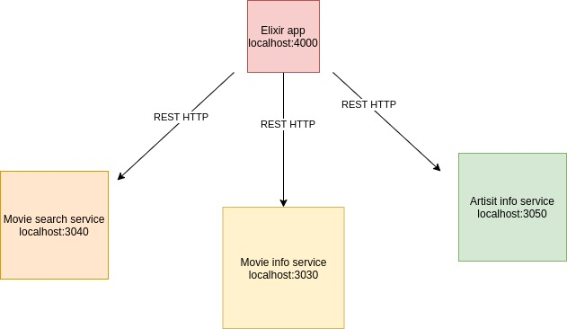
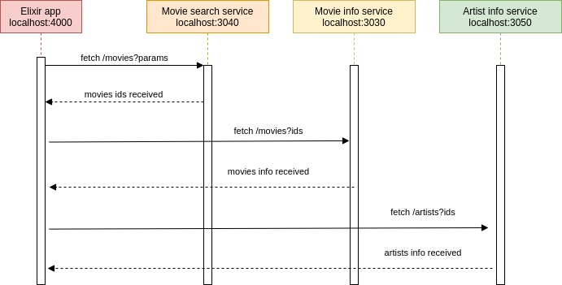

# Movie Finder

REST API that will allow the upstream clients to search for movies given a movie genre, and return details of each found movie.

Entirely coded with Elixir.

## How services communicate



### Sequence diagram



## Bring the infrastructure with Docker

```
docker-compose up -d
```

## Base URL

| Environment | BASE URL                    |
| ----------- | --------------------------- |
| Local       | `http://localhost:4000/api` |

## Example of a request

```
curl --request GET \
  --url 'http://localhost:4000/api/movies?genre=Drama&offset=0&limit=3'
```

`genre`: Matches the genre of the movie. Only single genre is allowed.

`offset`: Provides the starting index for the search results. Default is 0, if not specified.

`limit`: Provides the number of results returned per page. Default is 10 if not specified.

The genres are provided as a static resource in the `genres.json` file

## The "Downstream" services
The failure percent of the services are only there to simulate failures in downstream dependencies.

### Movie-Search Service
This service allows searching for movies based on genre and revenue.

**Service Address**: http://localhost:3040

**Git Repository** : https://github.com/keremk/movie-search

**Failure Percent** : This service can fail 10% of the time.

### Movie-Info Service
This service gives detailed movie info.

****Service Address****: http://localhost:3030

****Git Repository**** : https://github.com/keremk/movie-info

****Max Allowed Batch Size****: This service allows you to request a batch of maximum 5 items (through the ids query param).

****Failure Percent**** : This service can fail 20% of the time.

### Artist-Info Service
This service gives you detailed artist info.

**Service Address**: http://localhost:3050

**Git Repository** : https://github.com/keremk/artist-info

**Max Allowed Batch Size**: This service allows you to request a batch of maximum 5 items (through the ids query param).

**Failure Percent** : This service can fail 50% of the time. Really flaky one!


## Installation

To start your Phoenix server:

- Install dependencies with `mix deps.get`
- Load the environment variables `source .env`
- Start Phoenix endpoint with `mix run --no-halt`

You can also visit [`localhost:8080`](http://localhost:8080) from your browser.
